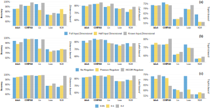
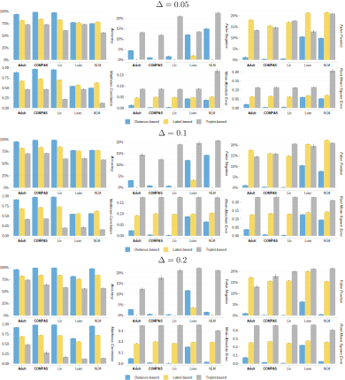

# Fair Metric Learning

Adversarial perturbation is used to expose vulnerabilities in machine learning models, while the concept of individual fairness aims to ensure equitable treatment regardless of sensitive attributes. Despite their initial differences, both concepts rely on metrics to generate similar input data instances. These metrics should be designed to align with the data's characteristics, especially when it is derived from causal structures and should reflect counterfactual instances. Previous attempts to define such metrics often lack general assumptions about input data and structural causal models. In our research, we introduce the novel concept of a causal fair metric for data with unknown causal structures containing sensitive features. We introduce the concept of protected causal perturbation, revealing new properties of this novel definition. Additionally, we delve into metric learning and propose an efficient method for estimating and applying this metric in real-world applications. Our innovative metric definition has practical applications in adversarial training, fair learning, algorithmic recourse, and causal bandit problems.


## Prerequisites

Install the packages in `requirements.txt`, for instance using

```
python -m venv myenv/
source myenv/bin/activate
pip install -r requirements.txt
```

## Running the Experiments

To run the experiments, execute the following commands:

```bash
#!/bin/bash

for i in {1..100}
do
   python main.py --seed $i
done
```

## Numerical Study

In the Numerical Study section, we endeavor to obtain empirical validation for the metric learning techniques. 
For a comprehensive comparison, we juxtapose our augmented deep learning methodologies, which incorporate causal structure and sensitive information, 
against other prevailing methods. 
To this end, we employ deep learning for the estimation of the embedding function and adopt the Siamese metric learning as the baseline. 
This can be stratified into three distinct scenarios relevant to the acquisition of a causal fair metric:

- Distance-based
- Label-based
- Triplet-based

# Results

This figure illustrates the impact of the causal metric assumption on the accuracy of deep metric models, highlighting their superiority over baseline methods:
(a) The accuracy performance, when comparing methods based on knowledge of embedding layer sizes and embedding space metric, indicates that, with the exception of the Triplet-based scenario, there is an enhancement in prediction accuracy.
(b) It is evident that in simpler models, the network effectively learns the embedding space properties. However, in situations with imprecise learning data about the metric, such as the Triplet-based scenario or non-linear SCM, the incorporation of decorrelation methods enhances accuracy.
(c) The stability of our methods is evident as the radius size increases, with notable improvements in accuracy for larger radii in distance-based and label-based scenarios.


Performance Comparison. This figures illustrate the outcomes of the experiment with different radius size. Error bars are included to represent the variability. Two performance metrics, Matthews correlation coefficient (MCC - higher values indicate superior performance) and false-positive rate (FP - lower values indicate better performance), are considered for the analysis.
